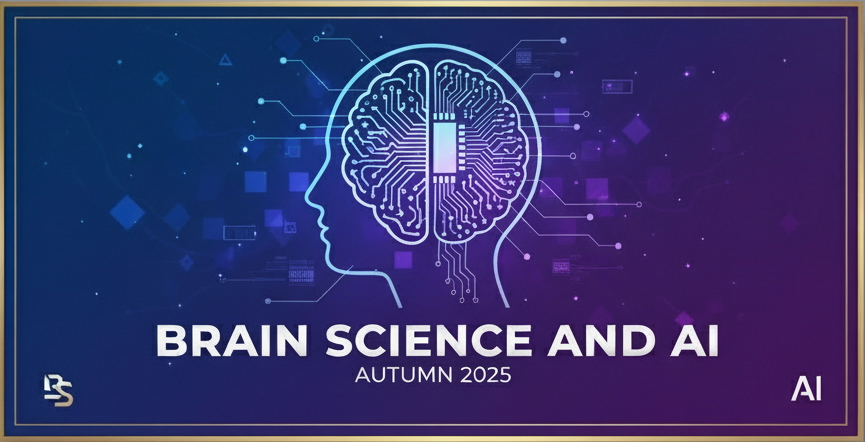

# Brain Science and AI
**Autumn 2025 | Brain Science and Artificial Intelligence**



## Course Description

This course explores the integration of brain science and AI through theory and hands-on practice. Students will learn how AI models help understand the brain and how neuroscience inspires AI algorithm development. Using visual information processing as a foundation, the course covers neural coding, information representation, computational neuroscience, and modern AI architectures including transformers and large language models.

## Course Information

- **Instructor:** Dr. Xiaoxuan Jia

## Learning Objectives

By the end of this course, students will be able to:
- Master fundamental concepts in computational neuroscience and neural coding
- Apply AI models (CNNs, RNNs, transformers) to analyze brain data
- Build practical skills in neural data analysis and modeling
- Understand how biological intelligence shapes AI development

## Repository Structure

```
brain-science-ai/
├── docs/                          # Course website
│   ├── index.html                 # Main course page
│   ├── schedule.html              # Weekly schedule
│   ├── project.html               # Project details
│   └── images/
├── lectures/                      # Lecture materials
│   ├── week01/
│   ├── week02/
│   └── ...
├── tutorials/                     # Programming tutorials
│   ├── week02-python-data/
│   ├── week04-glm/
│   ├── week05-cnn/
│   └── ...
├── resources/                     # Additional resources
│   └── datasets.md
└── README.md
```

## Course Schedule

| Week | Date | Topic | Tutorial |
|------|------|-------|----------|
| 1 | 09/18 | Introduction, Course Setup, Brain & AI Overview | Python Bootcamp |
| 2 | 09/25 | NeuroAI | Data Access with Python |
| 3 | 09/28 (Sun) | Neural Coding 1: Foundation, Information Theory, Correlation | - |
| 4 | 10/09 | Neural Coding 2: GLM, Latent Variable Models, Efficient Coding | GLM |
| 5 | 10/16 | Neural Coding 3: Divisive Normalization, DNN Encoding Models | CNN |
| 6 | 10/23 | Representation 1: RDM, Dimensionality Reduction, Self-Supervised Learning | Dimensionality Reduction |
| 7 | 10/30 | Representation 2: Theories, Manifolds, Capacity, DNN Comparisons | - |
| 8 | 11/06 | Generative Models, BCI (Project Team Finalization) | - |
| 9 | 11/13 | Linear Dynamical Systems, State Space Models | HMM |
| 10 | 11/20 | RNN Applications in Neuroscience | RNN |
| 11 | 11/27 | Network Neuroscience | NetworkX Analysis |
| 12 | 12/04 | Invited Speaker: Learning | - |
| 13 | 12/11 | Invited Speaker: Bayesian Theory in Neuroscience | - |
| 14 | 12/18 | Student-led Discussion | - |
| 15 | 12/25 | Project Presentations | - |

## Getting Started

### Prerequisites
- Basic knowledge of Python programming
- Familiarity with linear algebra and calculus
- Understanding of basic statistics and probability

### Setup Instructions

1. **Clone the repository:**
   ```bash
   git clone https://github.com/NeuralCoding-Lab/BSAI.git
   cd BSAI
   ```

2. **Install required packages:**
   ```bash
   pip install -r requirements.txt
   ```

3. **Set up Jupyter environment:**
   ```bash
   jupyter notebook
   ```

### Required Software
check README.md for each tutorial

## Tutorials

Weekly programming tutorials are located in the `tutorials/` directory:

- **Week 1:** Python bootcamp
- **Week 2:** Python for neural data access
- **Week 4:** Generalized Linear Models (GLM)
- **Week 5:** Convolutional Neural Networks (CNN)
- **Week 6:** Dimensionality reduction techniques
- **Week 9:** Hidden Markov Models (HMM)
- **Week 10:** Recurrent Neural Networks (RNN)
- **Week 11:** Network analysis with NetworkX

Each tutorial includes:
- Jupyter notebooks with step-by-step instructions
- Sample datasets
- Exercise solutions
- Additional resources

## Final Project

### Project Types
**A. Data Analysis and Modeling:** Conduct original modeling work, simulations, or data analysis based on course material.
**B. Research Summary:** Provide an in-depth exposition of a relevant research topic.

### Timeline
- **Week 8 (11/6):** Project proposal and team formation
- **Week 11 (11/27):** Progress check-in with TA
- **Weeks 14-15:** Final presentations

See `docs/project.html` for detailed project requirements and examples.

## Datasets

The course uses several key datasets:
- **Allen Brain Observatory:** Visual cortex recordings during behavioral tasks
- **International Brain Laboratory (IBL):** Decision-making task data
- **Primate datasets:** Various repositories (see Week 2 tutorial)
- **Public repositories:** CRCNS, DANDI, and others

Data access scripts and instructions are provided in the `datasets/` directory.


## Course Website

Visit the course website for announcements, detailed schedule, and additional resources:
[https://neuralcoding-lab.github.io/BSAI/](https://neuralcoding-lab.github.io/BSAI/)

## Contributing

### For Students
- Report issues or suggest improvements via GitHub Issues

### For Instructors and TAs
- Use pull requests for content updates
- Tag releases for each week's materials
- Maintain issue templates for common student questions


### Academic Integrity
All work must be original. Collaboration is encouraged for tutorials but discouraged for individual assignments. See course website for detailed policy.

### Accessibility
If you need accommodations, please contact the instructor as early as possible.

## Support

- **Technical Issues:** Create a GitHub issue or attend office hours
- **Course Content:** Attend office hours or discussion sessions
- **Project Questions:** Contact TAs during progress check-ins

## License

This course material is provided for educational purposes as part of the BSAI course by Jiaxx.
Course materials are licensed under [Creative Commons Attribution-NonCommercial-ShareAlike 4.0](https://creativecommons.org/licenses/by-nc-sa/4.0/).

## Acknowledgments

This course builds upon resources and inspiration from:
- python bootcamp from the 2016 Dynamic Brain Summer Course at Friday Harbor 
- Cursor to update it to python 3

---

